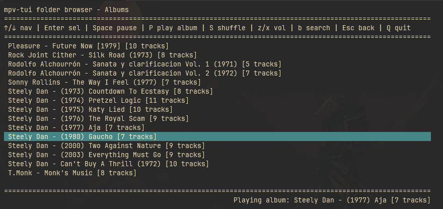

### mpv-tui-sharp

Es una interfaz de usuario de terminal (TUI) creada con C#, ligera y centrada en el teclado para el reproductor multimedia mpv. Proporciona una forma rápida de explorar y reproducir tu biblioteca de música local (album-oriented) directamente desde tu terminal de preferencia.

#### Características

- Indexación automática de la biblioteca: escanea un directorio de música para organizar automáticamente los álbumes y las pistas basándose en la estructura de carpetas.
- Configuración segura y persistente: guarda la ruta a tu directorio de música principal en el sistema, eliminando la necesidad de especificarla cada vez que se inicia.
- Navegación por teclado.
- Búsqueda en tiempo real.
- Control de reproducción integrado: envía comandos directamente a mpv para reproducir álbumes completos, pausar, reproducir toda la biblioteca en modo aleatorio (shuffle); saltar canción y bajar/subir volumen.

#### Requisitos
- [mpv](https://mpv.io/) instalado y en el PATH

#### Binds:
- `↑/↓` para navegar.
- `ENTER` para seleccionar.
- `SPACE` para pausar.
- `p` para reproducir album.
- `s` para reproducir en aleaotrio todas las carpetas.
- `z/x` subir y bajar el volumen. 
- `b` buscar artista/album.
- `ESC` para ir atrás.
- `q` para salir.